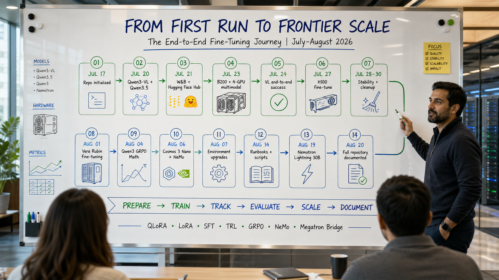

# Fine tuning experimentation on various AI Hardwares

```
Note: This repo is purely experimentation and not to be used for production.
There are lots of trial and error to get this to working.
Weights and Bias logs are deleted given i am using free tier
```

Finetune sweep parameters for optimal outcomes — a working collection of fine-tuning
scripts and cluster runbooks for Qwen, Llama, Nemotron and Cosmos models on
NVIDIA GH200 / H100 / B200 / Vera Rubin hardware, using QLoRA, LoRA, GRPO, TRL,
NeMo and Megatron Bridge, with Weights & Biases tracking and Hugging Face Hub upload.

## Timeline



| Date | Milestone |
| --- | --- |
| 2026-07-17 | Repo initialized. |
| 2026-07-20 | First multimodal fine-tune pass: `Qwen/Qwen3-VL-2B-Instruct` (H200) and `Qwen/Qwen3.5-2B`. |
| 2026-07-21 | Added Weights & Biases logging and Hugging Face Hub push. |
| 2026-07-23 | Ported vision fine-tuning to B200 hardware; extended to 4-GPU multimodal runs. |
| 2026-07-24 | Got 4-GPU multimodal fine-tuning working end-to-end on B200. |
| 2026-07-27 | Ran fine-tune job on H100 (Colossus bare metal). |
| 2026-07-28 – 2026-07-30 | Stability fixes and file cleanup/renaming across scripts. |
| 2026-08-01 | Fine-tuning on Vera Rubin (VR) hardware. |
| 2026-08-04 | GRPO reinforcement fine-tune of `Qwen/Qwen3-1.7B` on math, on Hecate (Vera Rubin). |
| 2026-08-06 | Cosmos3 Nano multimodal fine-tune (NeMo) on Vera Rubin. |
| 2026-08-07 | Dependency/environment upgrades across cluster runbooks. |
| 2026-08-14 | Further runbook and script updates. |
| 2026-08-19 | Fine-tuned `nvidia/NVIDIA-Nemotron-3.5-Lightning-30B-A3B-BF16` with NeMo Lightning on Hecate. |
| 2026-08-20 | README overhaul documenting the full set of scripts and runbooks. |

## Training scripts

| File | What it does |
| --- | --- |
| [finetune_qwen3b_working.py](finetune_qwen3b_working.py) | Baseline QLoRA fine-tune of `Qwen/Qwen2.5-3B-Instruct` on `OpenAssistant/oasst1`. Single run, known-good starting point. |
| [finetune_qwen3b_4runs.py](finetune_qwen3b_4runs.py) | Sweeps 4 hyperparameter configurations (LoRA rank/alpha, LR, dropout, weight decay) back-to-back and writes results to CSV. |
| [finetune_qwen3b_4runs_fixed.py](finetune_qwen3b_4runs_fixed.py) | Same 4-run sweep with memory-cleanup and eval-loss fixes between runs. |
| [finetune_qwen3b_4runs_wandb.py](finetune_qwen3b_4runs_wandb.py) | 4-run sweep with Weights & Biases logging of training/eval metrics per run. |
| [finetune_qwen3b_4runs_wandb_fixed.py](finetune_qwen3b_4runs_wandb_fixed.py) | Most complete sweep script — W&B logging plus the stability fixes. Use this one for Qwen2.5-3B sweeps. |
| [finetune_qwen35_2b_trl_wandb.py](finetune_qwen35_2b_trl_wandb.py) | Fine-tunes `Qwen/Qwen3.5-2B` with TRL SFT + 4-bit QLoRA, logs to W&B, pushes the LoRA adapter (and optional merged model) to the Hub. |
| [finetune_qwen3_vl_2b_llava_wandb.py](finetune_qwen3_vl_2b_llava_wandb.py) | First pass at multimodal fine-tuning of `Qwen/Qwen3-VL-2B-Instruct` on `HuggingFaceH4/llava-instruct-mix-vsft`. |
| [finetune_qwen3_vl_2b_llava_wandb_fixed.py](finetune_qwen3_vl_2b_llava_wandb_fixed.py) | Same VL fine-tune with image/collator handling fixes. |
| [finetune_qwen3_vl_2b_llava_wandb_fixed_v2.py](finetune_qwen3_vl_2b_llava_wandb_fixed_v2.py) | **Recommended** Qwen3-VL script — corrected processor, collator and TRL argument handling. |
| [finetune_lora_B200.py](finetune_lora_B200.py) | Minimal LoRA fine-tune of `meta-llama/Llama-3.2-1B` on SQuAD, targeted at B200 nodes with Lustre checkpoint paths. |
| [finetune_cosmos_predict2_5_lora.py](finetune_cosmos_predict2_5_lora.py) | End-to-end orchestration for `Cosmos-Predict2.5-2B` Video2World LoRA: env validation, HF/W&B auth, dataset download, prompt metadata, training, checkpoint consolidation, W&B export and Hub upload. |
| [finetune_qwen3b.sbatch](finetune_qwen3b.sbatch) | SLURM wrapper to submit the Qwen2.5-3B QLoRA job on a DLCluster node (1 GPU, 4h). |
| [preflight_check.sh](preflight_check.sh) | GH200 preflight validator — OS, GPU, driver, memory hotplug, CUDA toolkit, nvcc, compiler, disk and RAM. Idempotent. |

## Cluster and environment runbooks

| Doc | What it covers |
| --- | --- |
| [README_Qwen3_VL_LLaVA_Finetuning.md](README_Qwen3_VL_LLaVA_Finetuning.md) | Full guide for the Qwen3-VL-2B multimodal fine-tune: dataset, QLoRA config, W&B and Hub setup. |
| [installGH200.md](installGH200.md) | GH200 Ubuntu setup — NVIDIA driver install, memory-hotplug fix, Python env, PyTorch, HF/W&B auth, first training run. |
| [h100_finetune.md](h100_finetune.md) | Colossus bare-metal H100 lease: driver/CUDA install and running a fine-tune job. |
| [finetuningsetupH.md](finetuningsetupH.md) | H- and B-series Colossus bare-metal setup, including fixing a missing `nvidia-smi` on fresh Ubuntu. |
| [b200_finetune.md](b200_finetune.md) | B200 SLURM/enroot workflow — credentials, account lookup, container launch and Llama-3.2-1B LoRA training. |
| [h1008GPUeos.md](h1008GPUeos.md) | EOS 8×H100 multi-GPU fine-tune of Cosmos-Predict2-2B end to end. |
| [hecatecluster.md](hecatecluster.md) | Vera Rubin (Hecate) cluster basics — MFA login, compute selection, Llama-3.2-1B-Instruct QLoRA run. |
| [hecategrpo.md](hecategrpo.md) | GRPO reinforcement fine-tune of `Qwen/Qwen3-1.7B` on math, 4-GPU Rubin, pushed to `Balab2021/Qwen3-1.7B-GRPO-Math`. |
| [hecatenemolight.md](hecatenemolight.md) | Multi-GPU fine-tune of `nvidia/NVIDIA-Nemotron-3.5-Lightning-30B-A3B-BF16` on Hecate. |
| [hecatecosmos3nano.md](hecatecosmos3nano.md) | NeMo Cosmos 3 Nano multimodal fine-tune on Vera Rubin with a custom UCF101-subset dataset. |
| [pytchegrpo.md](pytchegrpo.md) | Same GRPO math recipe on a Pytche B200 4-GPU machine. |
| [pytchenemonano3.md](pytchenemonano3.md) | Nemotron 3 Nano fine-tune via NeMo / Megatron Bridge, with environment validation steps. |
| [nemo3lightningpytche.md](nemo3lightningpytche.md) | Nemotron 3 Lightning on Pytche — enroot credentials, model download and training. |
| [lyrispytchecluster.md](lyrispytchecluster.md) | Interactive jobs on Lyris/Pytche and other NV72, B200 and B300 clusters. |
| [dynamopytche.md](dynamopytche.md) | Dynamo + vLLM serving on Pytche (`Qwen/Qwen3-0.6B`) inside a NeMo container. |
| [nemo_finetuning.md](nemo_finetuning.md) | LoRA fine-tune of `nvidia/Nemotron-Mini-4B-Instruct` on OpenAssistant. |
| [nemotrolhf.md](nemotrolhf.md) | Fine-tuning Nemotron models straight from Hugging Face (`nvidia/Llama-3.1-Nemotron-Nano-8B-v1`). |

## Dependencies and results

| File | What it is |
| --- | --- |
| [requirements.txt](requirements.txt) | Core stack — torch 2.8+, transformers 4.56+, datasets, accelerate, peft, trl, bitsandbytes. |
| [requirements_qwen35_2b.txt](requirements_qwen35_2b.txt) | Qwen3.5-2B deps; pulls `transformers` from git main. |
| [requirements_qwen3_vl.txt](requirements_qwen3_vl.txt) | Qwen3-VL multimodal deps (Python 3.11/3.12, transformers from git main, `hf_xet`). |
| [requirementsh100.txt](requirementsh100.txt) | H100 install commands, including `flash-attn` built without isolation. |
| [experiment_results.csv](experiment_results.csv) | Sweep output — per-run LoRA config, train/eval loss, loss gap, runtime and throughput. |
| [images/](images/) | Screenshots of W&B runs and GPU utilization for the GRPO, NeMo Lightning and Cosmos Nano experiments. |
