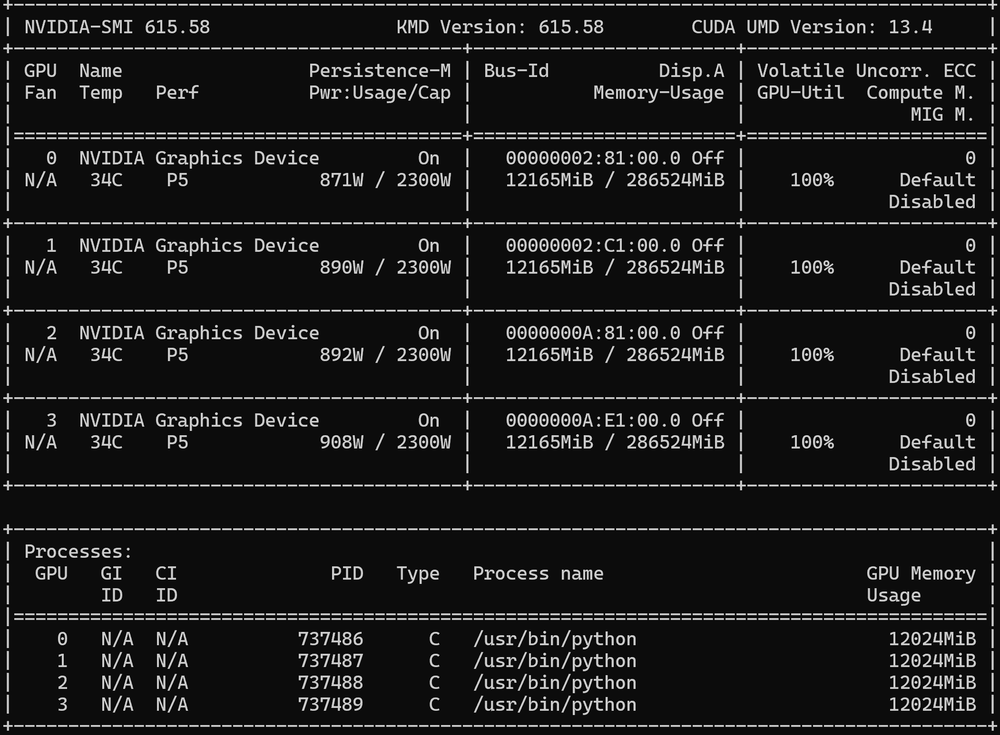

# Vera Rubin - Fine tuning

## Steps

- Log into SSH to hecate
- Use MFA login
- Next show the compute to choose from

```
sinfo --summarize
sacctmgr show associations user=$USER format=Account,Partition
squeue -u $USER
```

- create the enroot credentials

```
mkdir -p ~/.config/enroot
touch ~/.config/enroot/.credentials
```

- list all the compute 

```
sinfo --summarize
```

- create a interactive cluster

```
srun --account=general_sa \
     --partition=backfill-xdr \
     --nodes=1 \
     --ntasks-per-node=1 \
     --time=5:00:00 \
     --job-name=general_sa-finetune:interactive \
     --container-image=nvcr.io/nvidia/pytorch:25.01-py3 \
     --container-mount-home \
     --no-container-remap-root \
     --mpi=pmix \
     --pty bash
```

- install libraries for fine tuning

```
pip install transformers datasets accelerate peft bitsandbytes trl
```

- Check GPU

```
nvidia-smi
python -c "import torch; print(torch.cuda.device_count(), 'GPUs available')"
```

- install huggingface and wandb for logging

```
pip install huggingface_hub
pip install wandb
```

- log into huggingface and wandb

```
hf auth login --token "xxxx"
wandb login
```

- now create environment variables

```
export HF_TOKEN="xxxxxxxxxxxxxxxxxxxx"
export WANDB_API_KEY="xxxxxxxxxxxxxxxxxxxxx"
```

- now write the fine tuning code
- this is just to setup the environment as sample code

```
cat << 'EOF' > ~/finetune_lora.py
import os
import torch
from transformers import AutoModelForCausalLM, AutoTokenizer, TrainingArguments, Trainer, BitsAndBytesConfig, DataCollatorForLanguageModeling
from peft import LoraConfig, get_peft_model, prepare_model_for_kbit_training
from datasets import load_dataset
from huggingface_hub import login, HfApi
import wandb

# ---- Config ----
model_name = "meta-llama/Llama-3.2-1B-Instruct"
output_dir = os.path.expanduser("~/finetune-results")
hub_model_id = "Balab2021/llama-3.2-1b-squad-lora"
num_epochs = 15
batch_size = 4
gradient_accumulation = 4
learning_rate = 2e-4
max_seq_length = 1024
lora_r = 16
lora_alpha = 32
lora_dropout = 0.05

# ---- Login to HuggingFace Hub ----
hf_token = os.environ.get("HF_TOKEN")
if hf_token:
    login(token=hf_token)

# ---- Initialize W&B ----
wandb.init(
    project="llama-3.2-1b-squad-lora",
    name="qlora-finetune",
    config={
        "model_name": model_name,
        "num_epochs": num_epochs,
        "batch_size": batch_size,
        "gradient_accumulation": gradient_accumulation,
        "learning_rate": learning_rate,
        "max_seq_length": max_seq_length,
        "lora_r": lora_r,
        "lora_alpha": lora_alpha,
        "lora_dropout": lora_dropout,
    },
)

# ---- Quantization (QLoRA) ----
bnb_config = BitsAndBytesConfig(
    load_in_4bit=True,
    bnb_4bit_quant_type="nf4",
    bnb_4bit_compute_dtype=torch.bfloat16,
    bnb_4bit_use_double_quant=True,
)

# ---- Tokenizer ----
tokenizer = AutoTokenizer.from_pretrained(model_name, trust_remote_code=True)
if tokenizer.pad_token is None:
    tokenizer.pad_token = tokenizer.eos_token
tokenizer.padding_side = "right"

# ---- Model ----
model = AutoModelForCausalLM.from_pretrained(
    model_name,
    quantization_config=bnb_config,
    dtype=torch.bfloat16,
    device_map={"": int(os.environ.get("LOCAL_RANK", 0))},
    trust_remote_code=True,
)
model = prepare_model_for_kbit_training(model)

# ---- LoRA ----
lora_config = LoraConfig(
    r=lora_r,
    lora_alpha=lora_alpha,
    lora_dropout=lora_dropout,
    target_modules=["q_proj", "k_proj", "v_proj", "o_proj", "gate_proj", "up_proj", "down_proj"],
    task_type="CAUSAL_LM",
    bias="none",
)
model = get_peft_model(model, lora_config)
model.print_trainable_parameters()

# ---- Dataset ----
dataset = load_dataset("rajpurkar/squad", split="train[:5000]")

def format_sample(example):
    return {
        "text": f"### Question: {example['question']}\n### Context: {example['context']}\n### Answer: {example['answers']['text'][0]}"
    }

dataset = dataset.map(format_sample, remove_columns=dataset.column_names)

# ---- Tokenize ----
def tokenize_fn(example):
    tokens = tokenizer(
        example["text"],
        truncation=True,
        max_length=max_seq_length,
        padding="max_length",
    )
    tokens["labels"] = tokens["input_ids"].copy()
    return tokens

dataset = dataset.map(tokenize_fn, remove_columns=["text"], batched=False)

# ---- Data Collator ----
data_collator = DataCollatorForLanguageModeling(tokenizer=tokenizer, mlm=False)

# ---- Training Args ----
training_args = TrainingArguments(
    output_dir=output_dir,
    num_train_epochs=num_epochs,
    per_device_train_batch_size=batch_size,
    gradient_accumulation_steps=gradient_accumulation,
    learning_rate=learning_rate,
    bf16=True,
    logging_steps=10,
    save_steps=100,
    save_total_limit=3,
    warmup_ratio=0.03,
    lr_scheduler_type="cosine",
    optim="paged_adamw_32bit",
    gradient_checkpointing=True,
    report_to="wandb",
    ddp_find_unused_parameters=False,
    remove_unused_columns=False,
    push_to_hub=False,
)

# ---- Trainer ----
trainer = Trainer(
    model=model,
    train_dataset=dataset,
    args=training_args,
    data_collator=data_collator,
)

# ---- Train ----
print("Starting training...")
trainer.train()

# ---- Save locally ----
print(f"Saving model to {output_dir}")
trainer.save_model(output_dir)
tokenizer.save_pretrained(output_dir)

# ---- Push to HuggingFace Hub (after training) ----
print(f"Pushing model to HuggingFace Hub: {hub_model_id}")
api = HfApi()
api.create_repo(hub_model_id, exist_ok=True, private=False)
api.upload_folder(
    folder_path=output_dir,
    repo_id=hub_model_id,
    commit_message="Final QLoRA fine-tuned model",
)
print(f"Model uploaded: https://huggingface.co/{hub_model_id}")

# ---- Finish W&B run ----
wandb.finish()
print("Done!")
EOF
```

- Now ready to run the code
- we are using all the gpu available
- idea here is test the multi gpu runs

```
torchrun --nproc_per_node=$(nvidia-smi -L | wc -l) ~/finetune_lora.py
```

- wait for run to complete
- to view the GPU usage

```
squeue -u $USER
```

- get the job id and use that to ssh

```
srun --overlap --jobid=<YOUR_JOB_ID> --pty bash
```

```
tmux new -s train
```

```
watch -n 1 nvidia-smi
```



- if we can consume all gpu. next will be to optimize fine tuning code.