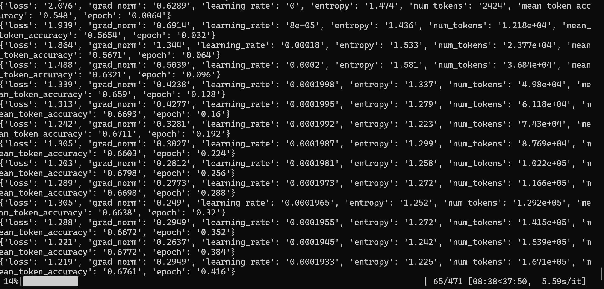
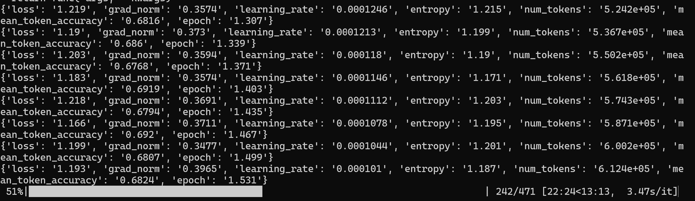
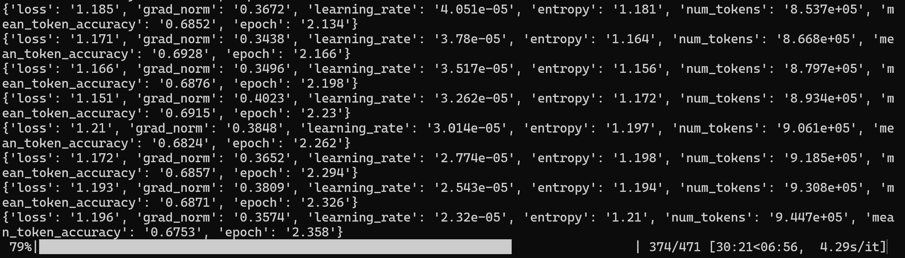
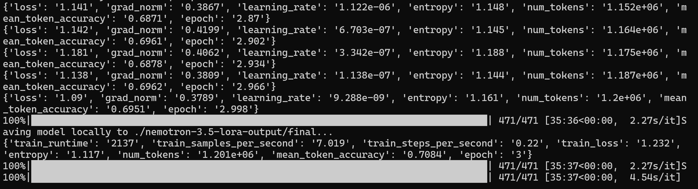
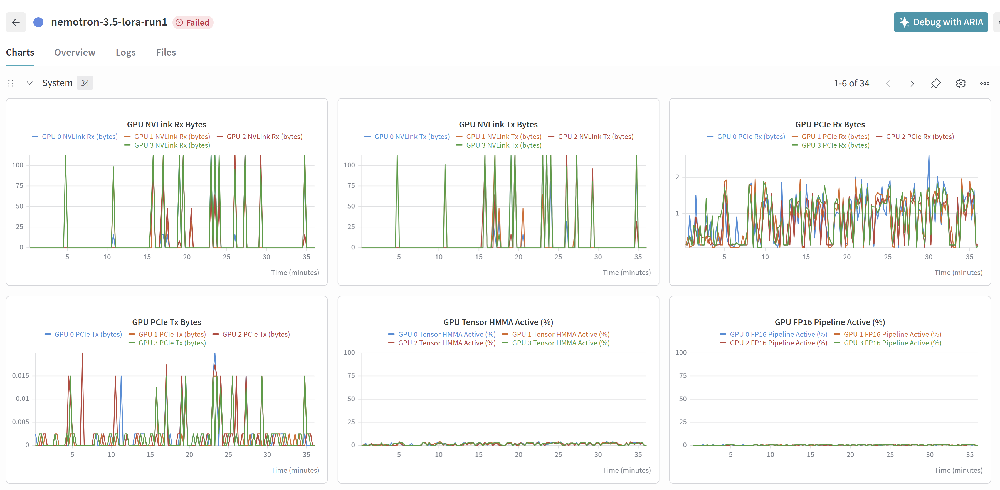

# Fine tuning Open Source model with Hecate - nvidia/NVIDIA-Nemotron-3.5-Lightning-30B-A3B-BF16

## Pre-requiste

- Need a Rubin 4 GPU Machine
- To validate multi gpu fine tuning
- Access to huggingface
- Access to wandb for metrics
- to validate multi model training
- model used nvidia/NVIDIA-Nemotron-3.5-Lightning-30B-A3B-BF16

## Steps

- Log into terminal
- Check the available machines to use

```
sinfo --summarize
sacctmgr show associations user=$USER format=Account,Partition
squeue -u $USER
```

- create enroot credentials

```
mkdir -p ~/.config/enroot
touch ~/.config/enroot/.credentials
```

- now create the credentials file

```
cat > ~/.config/enroot/.credentials << 'EOF'
machine gxxxxxx login xxx@xxxx.com password xxxxxxxxx
machine nvcr.io login $oauthtoken password xxxxxxxx
EOF
```

- Now lets get a interactive cluster to quick check
- Depends on the availability
- to get latest image use

```
srun --account=general_sa \
     --partition=batch-xdr \
     --nodes=1 \
     --ntasks-per-node=1 \
     --time=5:00:00 \
     --job-name=general_sa-finetune:interactive \
     --container-image=gitlab-master.nvidia.com/dl/dgx/pytorch:main-py3-devel \
     --container-mount-home \
     --no-container-remap-root \
     --mpi=pmix \
     --pty bash
```

- install transformers

```
pip install transformers datasets accelerate peft bitsandbytes trl
```

- validate the GPU

```
python -c "from trl import GRPOTrainer, GRPOConfig; print('OK')"
nvidia-smi
python -c "import torch; print(torch.cuda.device_count(), 'GPUs available')"
```

- install hf, wandb

```
pip install huggingface_hub wandb
```

- log into hf, wandb

```
hf auth login --token "xxxxxxxxxxxxxx"
wandb login
```

- Set the keys for hf and wandb

```
export HF_TOKEN="xxxxxxxxxxxxxxx"
export WANDB_API_KEY="xxxxx"
```

- clear up space and download the model
- this step is important as only 50GB is allocated as space

```
# 1. HuggingFace cache (222 MB) — small models metadata
rm -rf ~/.cache/huggingface/hub/*

# 2. Pip cache (177 MB)
pip cache purge

# 3. Container image (1.1 GB) — re-pull when needed
rm -f ~/nvidia+nemo+25.04.sqsh

# 4. Wandb, nemo, misc caches
rm -rf ~/.cache/wandb/*
rm -rf ~/.cache/nemo/*
rm -rf ~/.cache/matplotlib/*
rm -rf ~/.cache/flashinfer/*
rm -rf ~/.cache/tvm-ffi/*

# 5. ONLY if you don't need old training results:
# rm -rf ~/finetune-results/
# rm -rf ~/grpo-results/

# Verify
du -sh ~
quota -s
```

- download the model weights

```
export HF_HOME=/tmp/hf_cache
export HF_HUB_CACHE=/tmp/hf_cache/hub
export TMPDIR=/tmp
mkdir -p /tmp/hf_cache/hub
```

```
python -c '
from huggingface_hub import snapshot_download
snapshot_download("nvidia/NVIDIA-Nemotron-3.5-Lightning-30B-A3B-BF16", max_workers=2)
print("Done!")
'
```

- now write the fine tuning code

```
cat > /workspace/finetune_lora.py << 'EOF'
import os
import torch
from transformers import AutoModelForCausalLM, AutoTokenizer, BitsAndBytesConfig
from peft import LoraConfig, get_peft_model
from trl import SFTTrainer, SFTConfig
from datasets import load_dataset
from huggingface_hub import login, HfApi
import wandb

# ─── Credentials ───
hf_token = os.environ.get("HF_TOKEN", "")
wb_token = os.environ.get("WANDB_API_KEY", "")

if hf_token:
    login(token=hf_token)
if wb_token:
    wandb.login(key=wb_token)

# ─── Config ───
model_name = "nvidia/NVIDIA-Nemotron-3.5-Lightning-30B-A3B-BF16"
output_dir = "/workspace/finetune-results"
hub_model_id = "balabala76/nemotron-3.5-30b-a3b-lora-finetuned"  # <── CHANGE to your HF username/repo
num_epochs = 1
batch_size = 1
gradient_accumulation_steps = 4
learning_rate = 2e-4
max_length = 1024
lora_r = 16
lora_alpha = 32
lora_dropout = 0.05
num_examples = 5000

# ─── W&B ───
wandb.init(project="nemotron-3.5-30b-a3b-lora-finetune", name="nemotron-3.5-lora-run1")

# ─── Tokenizer ───
print(f"Loading tokenizer from {model_name}...")
tokenizer = AutoTokenizer.from_pretrained(model_name, trust_remote_code=True)
if tokenizer.pad_token is None:
    tokenizer.pad_token = tokenizer.eos_token

# ─── Model (4-bit QLoRA) ───
print(f"Loading model from {model_name} (4-bit QLoRA)...")
bnb_config = BitsAndBytesConfig(
    load_in_4bit=True,
    bnb_4bit_quant_type="nf4",
    bnb_4bit_compute_dtype=torch.bfloat16,
    bnb_4bit_use_double_quant=True,
)

model = AutoModelForCausalLM.from_pretrained(
    model_name,
    quantization_config=bnb_config,
    dtype=torch.bfloat16,
    device_map="auto",
    trust_remote_code=True,
)

print(f"Model loaded. Total params: {sum(p.numel() for p in model.parameters()):,}")

# ─── LoRA ───
lora_config = LoraConfig(
    r=lora_r,
    lora_alpha=lora_alpha,
    lora_dropout=lora_dropout,
    target_modules=["q_proj", "k_proj", "v_proj", "o_proj", "gate_proj", "up_proj", "down_proj"],
    bias="none",
    task_type="CAUSAL_LM",
)
model = get_peft_model(model, lora_config)
model.print_trainable_parameters()

# ─── Dataset ───
print("Loading dataset...")
dataset = load_dataset("rajpurkar/squad", split="train")
dataset = dataset.select(range(num_examples))

def format_example(example):
    return {"text": f"### Context:\n{example['context']}\n\n### Question:\n{example['question']}\n\n### Answer:\n{example['answers']['text'][0]}"}

dataset = dataset.map(format_example, remove_columns=dataset.column_names)
print(f"Dataset ready: {len(dataset)} examples")

# ─── Training Args ───
training_args = SFTConfig(
    output_dir=output_dir,
    num_train_epochs=num_epochs,
    per_device_train_batch_size=batch_size,
    gradient_accumulation_steps=gradient_accumulation_steps,
    learning_rate=learning_rate,
    warmup_steps=10,
    max_length=max_length,
    bf16=True,
    logging_steps=10,
    save_strategy="epoch",
    report_to="wandb",
    run_name="nemotron-3.5-lora-run1",
    gradient_checkpointing=True,
    dataset_text_field="text",
    remove_unused_columns=True,
    seed=42,
    push_to_hub=True,
    hub_model_id=hub_model_id,
    hub_token=hf_token,
)

# ─── Trainer ───
trainer = SFTTrainer(
    model=model,
    args=training_args,
    train_dataset=dataset,
    processing_class=tokenizer,
)

# ─── Train ───
trainer.train()

# ─── Save locally ───
final_path = os.path.join(output_dir, "final_model")
trainer.save_model(final_path)
tokenizer.save_pretrained(final_path)

# ─── Push to HuggingFace Hub ───
print(f"Pushing model to HuggingFace: {hub_model_id}...")
trainer.push_to_hub(commit_message="Fine-tuned Nemotron-3.5-30B-A3B with LoRA on SQuAD")
print(f"✅ Model uploaded to https://huggingface.co/{hub_model_id}")

wandb.finish()
print("Done!")
EOF
```

- now we run the fine tuning
- below uses distributed compute GPU

```
accelerate launch --num_processes=4 finetune_lora.py
```









- in case to manual upload weights

```
hf upload Balab2021/Nemotron-3.5-Lightning-30B-A3B-LoRA /workspace/nemotron-3.5-lora-output/final .
```

- wandb metrics



- Now we can explore based on custom dataset for business domains or use cases.