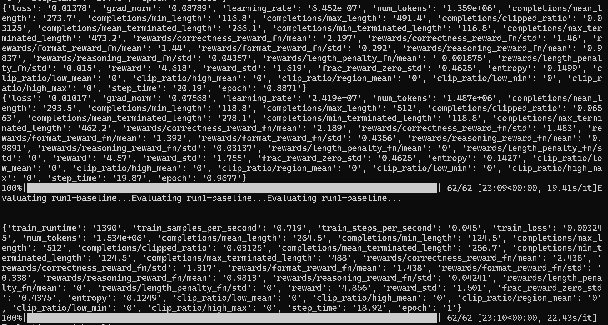
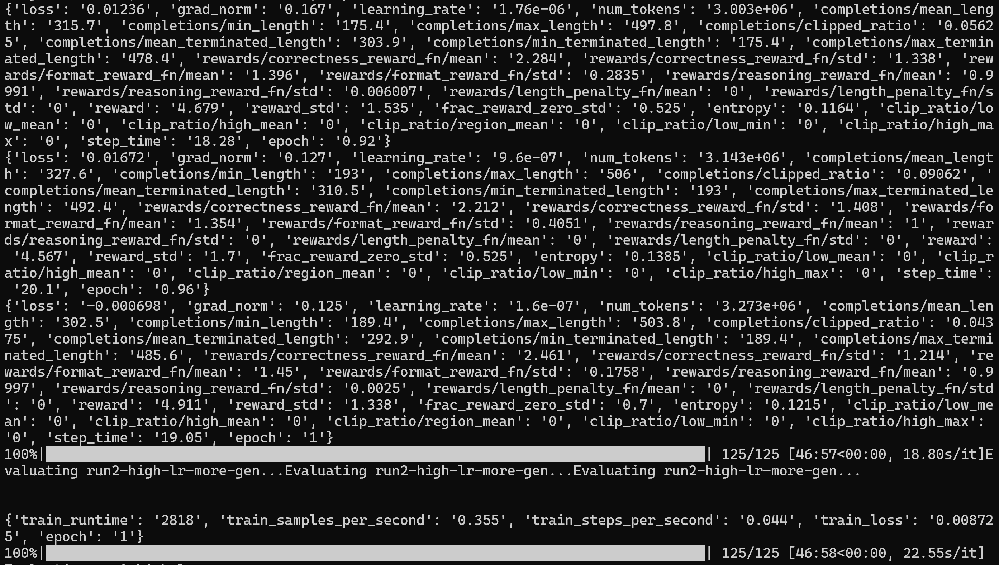
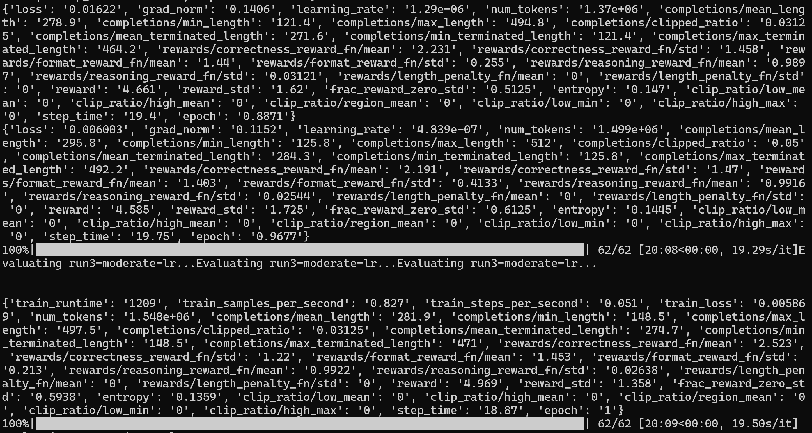
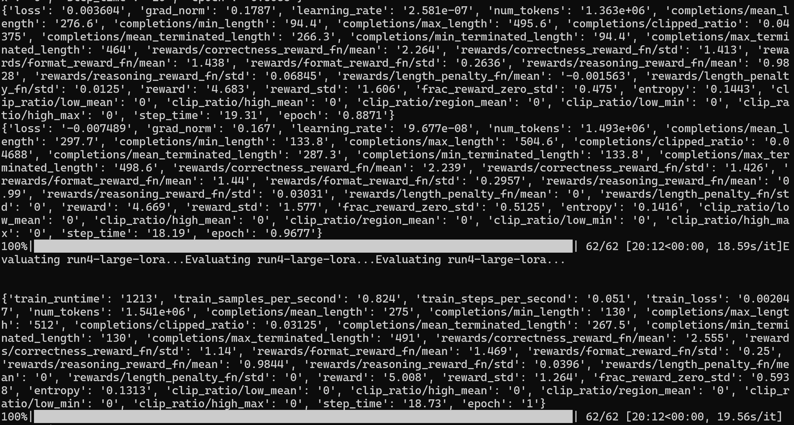
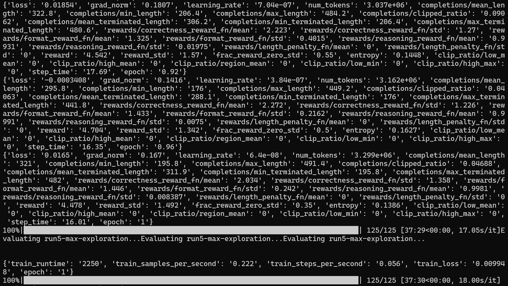

# Fine tuning Open Source model with Hecate - 5 different runs - Hyper parameter sweep

## Pre-requiste

- Need a Rubin 4 GPU Machine
- To validate multi gpu fine tuning
- Access to huggingface
- Access to wandb for metrics
- to validate multi model training

## Steps

- Log into terminal
- Check the available machines to use

```
sinfo --summarize
sacctmgr show associations user=$USER format=Account,Partition
squeue -u $USER
```

- create enroot credentials

```
mkdir -p ~/.config/enroot
touch ~/.config/enroot/.credentials
```

- now create the credentials file

```
cat > ~/.config/enroot/.credentials << 'EOF'
machine gxxxxxx login xxx@xxxx.com password xxxxxxxxx
machine nvcr.io login $oauthtoken password xxxxxxxx
EOF
```

- Now lets get a interactive cluster to quick check
- Depends on the availability
- to get latest image use

```
srun --account=general_sa \
     --partition=batch-xdr \
     --nodes=1 \
     --ntasks-per-node=1 \
     --time=5:00:00 \
     --job-name=general_sa-finetune:interactive \
     --container-image=gitlab-master.nvidia.com/dl/dgx/pytorch:main-py3-devel \
     --container-mount-home \
     --no-container-remap-root \
     --mpi=pmix \
     --pty bash
```

- the image i am using has all the libraries needed
- install only missing libraries

```
pip install transformers datasets accelerate peft bitsandbytes trl
```

- Fix to update TRL to latest for GRPOConfig
- test if the right library is installed

```
pip install "trl>=0.18" --no-deps
pip install "datasets>=3.0" --no-deps
```

- testing

```
python -c "from trl import GRPOTrainer, GRPOConfig; print('OK')"
```

- Check the GPU access

```
nvidia-smi
python -c "import torch; print(torch.cuda.device_count(), 'GPUs available')"
```

- now install huggingface and wandb

```
pip install huggingface_hub wandb
```

- Login into huggingface

```
hf auth login --token "xxxxxxxxxxxxxx"
```

- if hugging face login didn't work then use

```
export HF_TOKEN="xxxxxxxxxxxxxxx"
export WANDB_API_KEY="xxxxx"
```

- Login into wandb
- Need the wandb api key for authentication

```
wandb login
```

set the directory

```
# Set your account from the output above
export ACCOUNT="xxxx"

# Create and enter your Lustre directory
export LUSTRE_DIR="/lustre/fsw/$ACCOUNT/$USER"
mkdir -p "$LUSTRE_DIR"
cd "$LUSTRE_DIR"

# Verify access
pwd
touch storage_test
ls -l storage_test
rm storage_test
df -hT "$LUSTRE_DIR"
```

- now create the fine runing code

```
cat > grpo_5runs_sweep.py << 'ENDOFSCRIPT'
"""
GRPO Sweep: 5 runs with different hyperparameters to improve GSM8K accuracy.
Each run logs to WandB and results are saved to a JSON analytics file.

FIX: Qwen3 thinking mode disabled to prevent <think> block eating all tokens.
All runs: 1 epoch, 512 max tokens — fits in ~2 hours on 4x GPU.
"""
import os
import re
import json
import time
import torch
import wandb
from transformers import AutoModelForCausalLM, AutoTokenizer, BitsAndBytesConfig
from peft import LoraConfig
from datasets import load_dataset
from trl import GRPOTrainer, GRPOConfig

# ---- Run Configurations ----
RUN_CONFIGS = [
    {
        "name": "run1-baseline",
        "description": "Baseline: 1000 samples, LR 5e-6, 4 generations, LoRA r=16",
        "max_completion_length": 512,
        "num_samples": 1000,
        "learning_rate": 5e-6,
        "num_generations": 4,
        "per_device_train_batch_size": 4,
        "gradient_accumulation_steps": 4,
        "num_train_epochs": 1,
        "lora_r": 16,
        "lora_alpha": 32,
    },
    {
        "name": "run2-high-lr-more-gen",
        "description": "Higher LR (2e-5) with 8 generations for better exploration",
        "max_completion_length": 512,
        "num_samples": 1000,
        "learning_rate": 2e-5,
        "num_generations": 8,
        "per_device_train_batch_size": 8,
        "gradient_accumulation_steps": 2,
        "num_train_epochs": 1,
        "lora_r": 32,
        "lora_alpha": 64,
    },
    {
        "name": "run3-moderate-lr",
        "description": "Moderate LR (1e-5), LoRA r=32, 1000 samples",
        "max_completion_length": 512,
        "num_samples": 1000,
        "learning_rate": 1e-5,
        "num_generations": 4,
        "per_device_train_batch_size": 4,
        "gradient_accumulation_steps": 4,
        "num_train_epochs": 1,
        "lora_r": 32,
        "lora_alpha": 64,
    },
    {
        "name": "run4-large-lora",
        "description": "Large LoRA rank (64) with low LR (2e-6) for stable training",
        "max_completion_length": 512,
        "num_samples": 1000,
        "learning_rate": 2e-6,
        "num_generations": 4,
        "per_device_train_batch_size": 4,
        "gradient_accumulation_steps": 4,
        "num_train_epochs": 1,
        "lora_r": 64,
        "lora_alpha": 128,
    },
    {
        "name": "run5-max-exploration",
        "description": "Max exploration: 16 generations, LR 8e-6",
        "max_completion_length": 512,
        "num_samples": 500,
        "learning_rate": 8e-6,
        "num_generations": 16,
        "per_device_train_batch_size": 16,
        "gradient_accumulation_steps": 1,
        "num_train_epochs": 1,
        "lora_r": 32,
        "lora_alpha": 64,
    },
]

# ---- Constants ----
MODEL_NAME = "Qwen/Qwen3-1.7B"
OUTPUT_BASE = "/lustre/fsw/general_sa/bbalakreshna/grpo-results-sweep"
ANALYTICS_FILE = os.path.join(OUTPUT_BASE, "sweep_analytics.json")
WANDB_PROJECT = "qwen3-grpo-math"

SYSTEM_PROMPT = (
    "/no_think\n"
    "You are a helpful math assistant. "
    "Solve the problem step by step showing all your reasoning. "
    "Put your final numerical answer inside \\boxed{}."
)

# ---- Quantization ----
bnb_config = BitsAndBytesConfig(
    load_in_4bit=True,
    bnb_4bit_quant_type="nf4",
    bnb_4bit_compute_dtype=torch.bfloat16,
    bnb_4bit_use_double_quant=True,
)


def extract_text(completion):
    if isinstance(completion, str):
        text = completion
    elif isinstance(completion, list):
        texts = []
        for msg in completion:
            if isinstance(msg, dict) and "content" in msg:
                texts.append(msg["content"])
            elif isinstance(msg, str):
                texts.append(msg)
        text = "\n".join(texts)
    else:
        text = str(completion)
    text = re.sub(r'<think>.*?</think>', '', text, flags=re.DOTALL)
    return text.strip()


def correctness_reward_fn(completions, answer, **kwargs):
    rewards = []
    for completion, ans in zip(completions, answer):
        text = extract_text(completion)
        match = re.search(r'\\boxed\{([^}]*)\}', text)
        if match:
            predicted = match.group(1).strip().replace(",", "").replace(" ", "")
            expected = ans.strip().replace(",", "").replace(" ", "")
            if predicted == expected:
                rewards.append(3.0)
            else:
                try:
                    p, e = float(predicted), float(expected)
                    if abs(p - e) / max(abs(e), 1) < 0.01:
                        rewards.append(1.0)
                    else:
                        rewards.append(-0.5)
                except ValueError:
                    rewards.append(-0.5)
        else:
            rewards.append(-1.0)
    return rewards


def format_reward_fn(completions, **kwargs):
    rewards = []
    for completion in completions:
        text = extract_text(completion)
        if re.search(r'\\boxed\{[^}]+\}', text):
            rewards.append(1.5)
        elif "boxed" in text or "answer" in text.lower():
            rewards.append(0.2)
        else:
            rewards.append(-0.5)
    return rewards


def reasoning_reward_fn(completions, **kwargs):
    rewards = []
    for completion in completions:
        text = extract_text(completion)
        lines = text.strip().split("\n")
        score = 0.0
        if len(lines) >= 5:
            score += 0.5
        elif len(lines) >= 3:
            score += 0.3
        math_indicators = ["=", "+", "-", "*", "/", "therefore", "so", "thus", "step"]
        math_count = sum(1 for ind in math_indicators if ind in text.lower())
        score += min(math_count * 0.1, 0.5)
        if len(text.strip()) < 20:
            score = -0.5
        rewards.append(score)
    return rewards


def length_penalty_fn(completions, **kwargs):
    rewards = []
    for completion in completions:
        text = extract_text(completion)
        char_len = len(text.strip())
        if char_len < 50:
            rewards.append(-0.5)
        elif char_len > 2000:
            rewards.append(-0.3)
        else:
            rewards.append(0.0)
    return rewards


def prepare_dataset(num_samples):
    dataset = load_dataset("openai/gsm8k", "main", split=f"train[:{num_samples}]")

    def format_dataset(example):
        return {
            "prompt": [
                {"role": "system", "content": SYSTEM_PROMPT},
                {"role": "user", "content": example["question"]},
            ],
            "answer": example["answer"].split("####")[-1].strip(),
        }

    return dataset.map(format_dataset, remove_columns=["question"])


def evaluate_model(trainer, tokenizer, num_eval=50):
    eval_dataset = load_dataset("openai/gsm8k", "main", split=f"test[:{num_eval}]")
    correct = 0
    total = 0

    model = trainer.model
    model.eval()

    for example in eval_dataset:
        messages = [
            {"role": "system", "content": SYSTEM_PROMPT},
            {"role": "user", "content": example["question"]},
        ]
        input_text = tokenizer.apply_chat_template(
            messages, tokenize=False, add_generation_prompt=True,
            enable_thinking=False,
        )
        inputs = tokenizer(input_text, return_tensors="pt", truncation=True, max_length=1024)
        inputs = {k: v.to(model.device) for k, v in inputs.items()}

        with torch.no_grad():
            outputs = model.generate(
                **inputs,
                max_new_tokens=512,
                do_sample=False,
                temperature=1.0,
            )

        generated = tokenizer.decode(outputs[0][inputs["input_ids"].shape[1]:], skip_special_tokens=True)
        generated = re.sub(r'<think>.*?</think>', '', generated, flags=re.DOTALL).strip()
        expected = example["answer"].split("####")[-1].strip().replace(",", "")

        match = re.search(r'\\boxed\{([^}]*)\}', generated)
        if match:
            predicted = match.group(1).strip().replace(",", "")
            if predicted == expected:
                correct += 1
        total += 1

    model.train()
    return correct / total if total > 0 else 0.0


def main():
    os.makedirs(OUTPUT_BASE, exist_ok=True)

    all_results = []
    completed_names = set()
    if os.path.exists(ANALYTICS_FILE):
        with open(ANALYTICS_FILE, "r") as f:
            existing = json.load(f)
            all_results = existing.get("runs", [])
            completed_names = {r["run_name"] for r in all_results}
            print(f"Resuming: {len(completed_names)} run(s) already done — {completed_names}")

    wandb.login()

    for run_idx, config in enumerate(RUN_CONFIGS):
        if config["name"] in completed_names:
            print(f"\n  SKIPPING {config['name']} (already completed)")
            continue

        print(f"\n{'='*60}")
        print(f"  RUN {run_idx+1}/5: {config['name']}")
        print(f"  {config['description']}")
        print(f"{'='*60}\n")

        run_output_dir = os.path.join(OUTPUT_BASE, config["name"])
        os.makedirs(run_output_dir, exist_ok=True)

        run = wandb.init(
            project=WANDB_PROJECT,
            name=config["name"],
            tags=["grpo", "qwen3", "qlora", "gsm8k", "sweep", "no-think"],
            config={
                "model": MODEL_NAME,
                "max_completion_length": config["max_completion_length"],
                "num_samples": config["num_samples"],
                "learning_rate": config["learning_rate"],
                "num_generations": config["num_generations"],
                "per_device_train_batch_size": config["per_device_train_batch_size"],
                "gradient_accumulation_steps": config["gradient_accumulation_steps"],
                "num_train_epochs": config["num_train_epochs"],
                "lora_r": config["lora_r"],
                "lora_alpha": config["lora_alpha"],
                "thinking_mode": "disabled",
            },
            reinit=True,
        )

        tokenizer = AutoTokenizer.from_pretrained(MODEL_NAME, trust_remote_code=True)
        if tokenizer.pad_token is None:
            tokenizer.pad_token = tokenizer.eos_token
        tokenizer.padding_side = "left"

        model = AutoModelForCausalLM.from_pretrained(
            MODEL_NAME,
            quantization_config=bnb_config,
            dtype=torch.bfloat16,
            device_map={"": int(os.environ.get("LOCAL_RANK", 0))},
            trust_remote_code=True,
        )

        lora_config = LoraConfig(
            r=config["lora_r"],
            lora_alpha=config["lora_alpha"],
            lora_dropout=0.05,
            target_modules=["q_proj", "k_proj", "v_proj", "o_proj",
                            "gate_proj", "up_proj", "down_proj"],
            task_type="CAUSAL_LM",
            bias="none",
        )

        dataset = prepare_dataset(config["num_samples"])

        grpo_config = GRPOConfig(
            output_dir=run_output_dir,
            num_generations=config["num_generations"],
            per_device_train_batch_size=config["per_device_train_batch_size"],
            gradient_accumulation_steps=config["gradient_accumulation_steps"],
            num_train_epochs=config["num_train_epochs"],
            learning_rate=config["learning_rate"],
            bf16=True,
            logging_steps=5,
            save_steps=100,
            save_total_limit=2,
            gradient_checkpointing=True,
            report_to="wandb",
            max_completion_length=config["max_completion_length"],
        )

        trainer = GRPOTrainer(
            model=model,
            reward_funcs=[
                correctness_reward_fn,
                format_reward_fn,
                reasoning_reward_fn,
                length_penalty_fn,
            ],
            args=grpo_config,
            train_dataset=dataset,
            peft_config=lora_config,
            processing_class=tokenizer,
        )

        start_time = time.time()
        print(f"Starting training for {config['name']}...")
        train_result = trainer.train()
        train_time = time.time() - start_time

        print(f"Evaluating {config['name']}...")
        accuracy = evaluate_model(trainer, tokenizer, num_eval=50)
        print(f"  Accuracy on 50 test samples: {accuracy:.2%}")

        wandb.log({
            "eval/accuracy": accuracy,
            "train/total_time_seconds": train_time,
            "train/total_steps": train_result.global_step,
            "train/final_loss": train_result.training_loss,
        })

        trainer.save_model(run_output_dir)
        tokenizer.save_pretrained(run_output_dir)

        run_result = {
            "run_name": config["name"],
            "description": config["description"],
            "config": {
                "max_completion_length": config["max_completion_length"],
                "num_samples": config["num_samples"],
                "learning_rate": config["learning_rate"],
                "num_generations": config["num_generations"],
                "per_device_train_batch_size": config["per_device_train_batch_size"],
                "gradient_accumulation_steps": config["gradient_accumulation_steps"],
                "num_train_epochs": config["num_train_epochs"],
                "lora_r": config["lora_r"],
                "lora_alpha": config["lora_alpha"],
            },
            "results": {
                "accuracy": accuracy,
                "training_loss": train_result.training_loss,
                "total_steps": train_result.global_step,
                "train_time_seconds": round(train_time, 1),
                "train_time_minutes": round(train_time / 60, 1),
            },
            "output_dir": run_output_dir,
            "wandb_run_id": run.id,
            "wandb_run_url": run.url,
        }
        all_results.append(run_result)

        analytics = {
            "sweep_project": WANDB_PROJECT,
            "model": MODEL_NAME,
            "total_runs": len(RUN_CONFIGS),
            "completed_runs": len(all_results),
            "runs": all_results,
        }
        with open(ANALYTICS_FILE, "w") as f:
            json.dump(analytics, f, indent=2)
        print(f"  Analytics saved to {ANALYTICS_FILE}")

        wandb.finish()

        del model, trainer
        torch.cuda.empty_cache()

    print(f"\n{'='*60}")
    print("  SWEEP COMPLETE — SUMMARY")
    print(f"{'='*60}")
    for r in all_results:
        print(f"  {r['run_name']:30s} | Acc: {r['results']['accuracy']:.2%} | "
              f"Loss: {r['results']['training_loss']:.4f} | "
              f"Time: {r['results']['train_time_minutes']:.1f}min")
    print(f"\nFull analytics: {ANALYTICS_FILE}")
    print(f"WandB project: https://wandb.ai/balabala76/{WANDB_PROJECT}")


if __name__ == "__main__":
    main()
ENDOFSCRIPT
```

- now run the multi model fine tuning with multiple GPU
- i am trying to keep the run less than 2 hours.
- check ths pace

```
df -h /lustre/fsw/general_sa/bbalakreshna/

# Check how much you're already using there
du -sh /lustre/fsw/general_sa/bbalakreshna/

# Breakdown of what's inside
du -sh /lustre/fsw/general_sa/bbalakreshna/*/
```

- clean up

```
# ---- Old checkpoints (usually the biggest) ----
rm -rf /lustre/fsw/general_sa/bbalakreshna/checkpoints/*

# ---- Old GRPO results from previous runs ----
rm -rf /lustre/fsw/general_sa/bbalakreshna/grpo-results-sweep/*

# ---- Old finetune outputs ----
rm -rf /lustre/fsw/general_sa/bbalakreshna/finetune/outputs/*

# ---- HuggingFace cache (re-downloads on next run) ----
rm -rf /lustre/fsw/general_sa/bbalakreshna/.cache/huggingface/hub

# ---- WandB local logs ----
rm -rf /lustre/fsw/general_sa/bbalakreshna/wandb

# ---- Verify space freed ----
du -sh /lustre/fsw/general_sa/bbalakreshna/
```

- Here is the sample runs times

> All runs: **1 epoch, 512 max tokens, 4× GPU, Qwen3-1.7B QLoRA**

| Run | Config Highlights | ~Steps | ~Time |
|-----|-------------------|--------|-------|
| 1 – baseline | LR 5e-6, 4 gen, LoRA r=16, 1000 samples | 62 | 24 min |
| 2 – high LR, 8 gen | LR 2e-5, 8 gen, LoRA r=32, 1000 samples | 31 | 20 min |
| 3 – moderate LR | LR 1e-5, 4 gen, LoRA r=32, 1000 samples | 62 | 24 min |
| 4 – large LoRA | LR 2e-6, 4 gen, LoRA r=64, 1000 samples | 62 | 24 min |
| 5 – max exploration | LR 8e-6, 16 gen, LoRA r=32, 500 samples | 31 | 15 min |
| + eval (5×50 samples) | Greedy decode on GSM8K test | — | 10 min |
| **Total** | | | **~2 hrs** ✅ |

### Key Fixes Applied
- **`/no_think`** in system prompt — disables Qwen3 thinking mode to prevent `<think>` blocks consuming all tokens
- **`<think>` stripping** in `extract_text()` — safety net for residual think blocks
- **`enable_thinking=False`** in eval `apply_chat_template` — clean greedy eval
- **Resume support** — skips completed runs via `sweep_analytics.json`
- **Output path:** `/lustre/fsw/general_sa/bbalakreshna/grpo-results-sweep/`

```
accelerate launch --num_processes 4 grpo_5runs_sweep.py
```

- Wait for the run to complete
- This run is just few epoch to test the multi GPU run.











- Run informationis saved in

```
/lustre/fsw/general_sa/bbalakreshna/grpo-results-sweep/sweep_analytics.json
```

- display the content

```
cat /lustre/fsw/general_sa/bbalakreshna/grpo-results-sweep/sweep_analytics.json
```
> Results

## 🏆 GRPO 5-Run Sweep — Final Results

| Run | Config | Accuracy | Loss | Time |
|-----|--------|----------|------|------|
| run1-baseline | LR 5e-6, 4 gen, LoRA r=16 | 72% | 0.0034 | 23 min |
| run2-high-lr-more-gen | LR 2e-5, 8 gen, LoRA r=32 | 74% | 0.0087 | 48 min |
| **run3-moderate-lr** ✅ | **LR 1e-5, 4 gen, LoRA r=32** | **76%** | **0.0052** | **21 min** |
| run4-large-lora | LR 2e-6, 4 gen, LoRA r=64 | 74% | 0.0018 | 21 min |
| run5-max-exploration | LR 8e-6, 16 gen, LoRA r=32 | 70% | 0.0099 | 39 min |

- To run in 4 nodes with each 4 GPU
- after mount is set for storage create a script
- first create the gpro run script
- then to run in parallel

```
cat > /lustre/fsw/general_sa/bbalakreshna/launch_sweep.sh << 'EOF'
#!/bin/bash
set -e

echo "$(hostname): Installing dependencies..."
pip install --quiet transformers datasets accelerate peft bitsandbytes trl huggingface_hub wandb

# Login to Hugging Face (use your token)
export HF_TOKEN="xxxx"
hf auth login --token "xxxx"

# Login to W&B (use your API key)
export WANDB_API_KEY="xxxx"

echo "$(hostname): Launching training..."
torchrun \
  --nnodes=$SLURM_JOB_NUM_NODES \
  --nproc_per_node=4 \
  --rdzv_backend=c10d \
  --rdzv_endpoint=$MASTER_ADDR:$MASTER_PORT \
  /lustre/fsw/general_sa/bbalakreshna/grpo_5runs_sweep.py
EOF

chmod +x /lustre/fsw/general_sa/bbalakreshna/launch_sweep.sh
```

- then launch the training
- let's first cancel anything running

```
# 1. Cancel everything
scancel -u bbalakreshna

# 2. Confirm nothing is left
squeue -u bbalakreshna
```

```
srun --account=general_sa \
     --partition=batch-xdr \
     --nodes=4 \
     --ntasks-per-node=1 \
     --time=5:00:00 \
     --job-name=general_sa-finetune.grposweep \
     --container-image=gitlab-master.nvidia.com/dl/dgx/pytorch:main-py3-devel \
     --container-mount-home \
     --container-mounts=/lustre:/lustre \
     --no-container-remap-root \
     --mpi=pmix \
     --export=ALL \
     /lustre/fsw/general_sa/bbalakreshna/launch_sweep.sh
```

