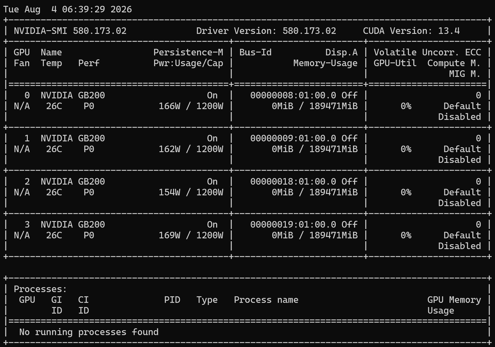
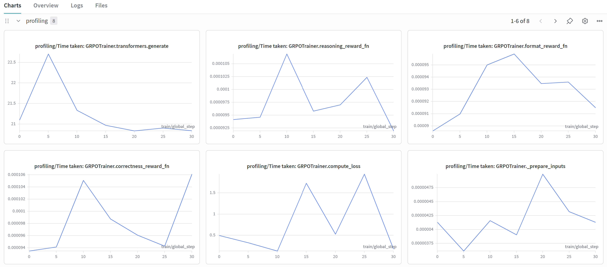
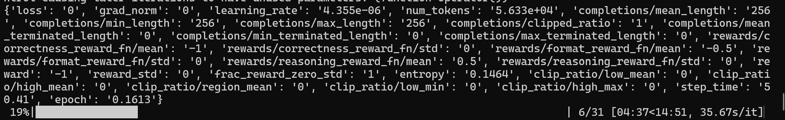
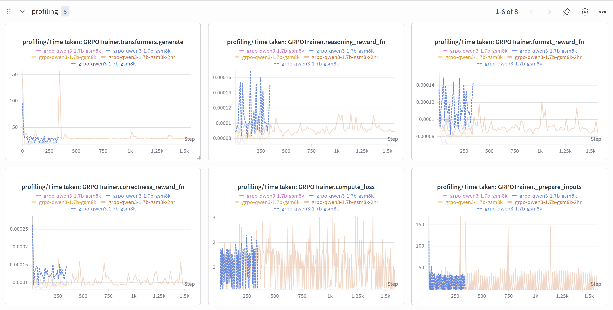
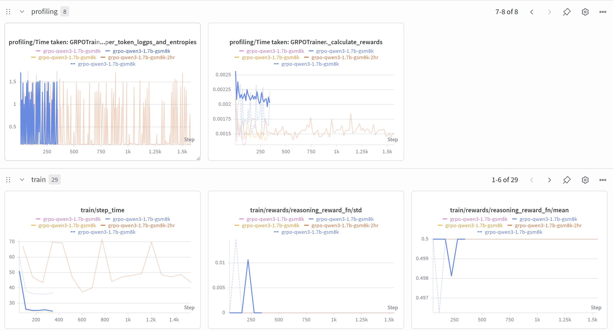
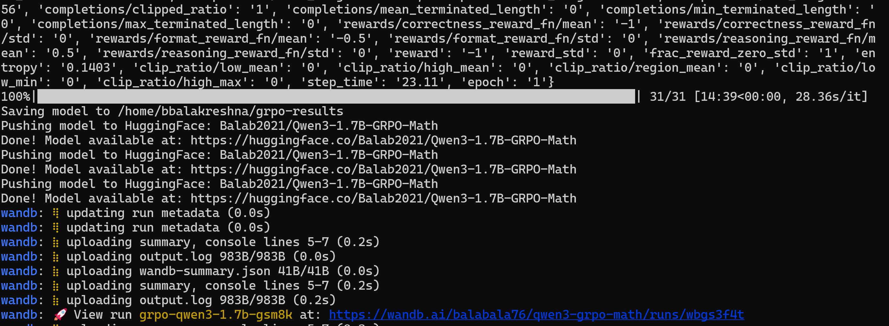

# Fine tuning Open Source model with Pytche

## Pre-requiste

- Need a B200 4 GPU Machine
- To validate multi gpu fine tuning
- Access to huggingface
- Access to wandb for metrics
- to validate multi model training

## Steps

- Log into terminal
- Check the available machines to use

```
sinfo --summarize
sacctmgr show associations user=$USER format=Account,Partition
squeue -u $USER
```

- Now lets get a interactive cluster to quick check
- Depends on the availability

```
srun --account=general_sa \
     --partition=36x2-a01r \
     --nodes=1 \
     --ntasks-per-node=1 \
     --time=5:00:00 \
     --job-name=general_sa-finetune:interactive \
     --container-image=gitlab-master.nvidia.com/dl/dgx/pytorch:main-py3-devel \
     --container-mount-home \
     --no-container-remap-root \
     --mpi=pmix \
     --pty bash
```

- the image i am using has all the libraries needed
- install only missing libraries

```
pip install transformers datasets accelerate peft bitsandbytes trl
```

- Check the GPU access

```
nvidia-smi
python -c "import torch; print(torch.cuda.device_count(), 'GPUs available')"
```

- now install huggingface and wandb

```
pip install huggingface_hub
pip install wandb
```

- Login into huggingface

```
hf auth login --token "xxxxxxxxxxxxxx"
```

- Login into wandb
- Need the wandb api key for authentication

```
wandb login
```

- now create the fine runing code

```
cat << 'EOF' > ~/finetune_grpo.py
import os
import re
import torch
import wandb
from transformers import AutoModelForCausalLM, AutoTokenizer, BitsAndBytesConfig
from peft import LoraConfig
from datasets import load_dataset
from trl import GRPOTrainer, GRPOConfig

# ---- WandB Login ----
wandb.login()
wandb.init(
    project="qwen3-grpo-math",
    name="grpo-qwen3-1.7b-gsm8k",
    tags=["grpo", "qwen3", "qlora", "gsm8k"],
)

# ---- Config ----
model_name = "Qwen/Qwen3-1.7B"
output_dir = os.path.expanduser("~/grpo-results")
hf_repo = "Balab2021/Qwen3-1.7B-GRPO-Math"

# ---- Quantization (QLoRA) ----
bnb_config = BitsAndBytesConfig(
    load_in_4bit=True,
    bnb_4bit_quant_type="nf4",
    bnb_4bit_compute_dtype=torch.bfloat16,
    bnb_4bit_use_double_quant=True,
)

# ---- Tokenizer ----
tokenizer = AutoTokenizer.from_pretrained(model_name, trust_remote_code=True)
if tokenizer.pad_token is None:
    tokenizer.pad_token = tokenizer.eos_token
tokenizer.padding_side = "left"

# ---- Model ----
model = AutoModelForCausalLM.from_pretrained(
    model_name,
    quantization_config=bnb_config,
    dtype=torch.bfloat16,
    device_map={"": int(os.environ.get("LOCAL_RANK", 0))},
    trust_remote_code=True,
)

# ---- LoRA ----
lora_config = LoraConfig(
    r=16,
    lora_alpha=32,
    lora_dropout=0.05,
    target_modules=["q_proj", "k_proj", "v_proj", "o_proj", "gate_proj", "up_proj", "down_proj"],
    task_type="CAUSAL_LM",
    bias="none",
)

# ---- Dataset: GSM8K (reduced to 500) ----
dataset = load_dataset("openai/gsm8k", "main", split="train[:500]")

SYSTEM_PROMPT = (
    "You are a helpful math assistant. "
    "Solve the problem step by step. "
    "Put your final numerical answer inside \\boxed{}."
)

def format_dataset(example):
    return {
        "prompt": [
            {"role": "system", "content": SYSTEM_PROMPT},
            {"role": "user", "content": example["question"]},
        ],
        "answer": example["answer"].split("####")[-1].strip(),
    }

dataset = dataset.map(format_dataset, remove_columns=["question"])

# ===========================================================
#  HELPER
# ===========================================================
def extract_text(completion):
    if isinstance(completion, str):
        return completion
    elif isinstance(completion, list):
        texts = []
        for msg in completion:
            if isinstance(msg, dict) and "content" in msg:
                texts.append(msg["content"])
            elif isinstance(msg, str):
                texts.append(msg)
        return "\n".join(texts)
    else:
        return str(completion)

# ===========================================================
#  REWARD FUNCTIONS
# ===========================================================
def correctness_reward_fn(completions, answer, **kwargs):
    rewards = []
    for completion, ans in zip(completions, answer):
        text = extract_text(completion)
        match = re.search(r'\\boxed\{([^}]*)\}', text)
        if match:
            predicted = match.group(1).strip().replace(",", "")
            expected = ans.strip().replace(",", "")
            rewards.append(2.0 if predicted == expected else -1.0)
        else:
            rewards.append(-1.0)
    return rewards

def format_reward_fn(completions, **kwargs):
    rewards = []
    for completion in completions:
        text = extract_text(completion)
        if re.search(r'\\boxed\{[^}]+\}', text):
            rewards.append(1.0)
        else:
            rewards.append(-0.5)
    return rewards

def reasoning_reward_fn(completions, **kwargs):
    rewards = []
    for completion in completions:
        text = extract_text(completion)
        lines = text.strip().split("\n")
        if len(lines) >= 3:
            rewards.append(0.5)
        elif len(lines) >= 2:
            rewards.append(0.2)
        else:
            rewards.append(-0.5)
    return rewards

# ---- GRPO Config (OPTIMIZED + WANDB) ----
grpo_config = GRPOConfig(
    output_dir=output_dir,
    num_generations=2,
    per_device_train_batch_size=4,
    gradient_accumulation_steps=2,
    num_train_epochs=1,
    learning_rate=5e-6,
    bf16=True,
    logging_steps=5,
    save_steps=50,
    save_total_limit=3,
    gradient_checkpointing=True,
    report_to="wandb",
    max_completion_length=256,
    push_to_hub=True,
    hub_model_id=hf_repo,
    hub_strategy="end",
)

# ---- Trainer ----
trainer = GRPOTrainer(
    model=model,
    reward_funcs=[correctness_reward_fn, format_reward_fn, reasoning_reward_fn],
    args=grpo_config,
    train_dataset=dataset,
    peft_config=lora_config,
    processing_class=tokenizer,
)

# ---- Train ----
print("Starting GRPO training...")
trainer.train()

# ---- Save ----
print(f"Saving model to {output_dir}")
trainer.save_model(output_dir)
tokenizer.save_pretrained(output_dir)

# ---- Push to HuggingFace Hub ----
print(f"Pushing model to HuggingFace: {hf_repo}")
trainer.push_to_hub(commit_message="GRPO fine-tuned Qwen3-1.7B on GSM8K")
print(f"Done! Model available at: https://huggingface.co/{hf_repo}")

# ---- Finish WandB ----
wandb.finish()
EOF
```

- now run the multi model fine tuning with multiple GPU

```
torchrun --nproc_per_node=4 ~/finetune_grpo.py
```

- or

```
accelerate launch --num_processes=$(nvidia-smi -L | wc -l) --multi_gpu ~/finetune_grpo.py
```

- Wait for the run to complete
- This run is just few epoch to test the multi GPU run.



- Seeing wandb metrics



- Status of run



- Wandb metrics view




- here is the URL to check the metrics

```
https://wandb.ai/balabala76/qwen3-grpo-math/runs/bl00xnfc
```



# Conclusion

- was able to run the GRPO RL based fine tuning for multi modal vision model.
- tested torchrun and accelerate to run just epoch 1
- next to optimize the run.