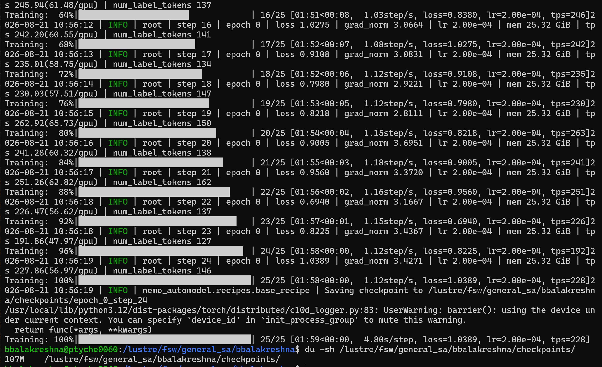

# Fine tuning lora Open Source model with Pytche - nvidia/NVIDIA-Nemotron-3.5-Lightning-30B-A3B-BF16

## Pre-requiste

- Need a Blackwell 4 GPU Machine
- using nemo framework - nvcr.io#nvidia/nemo:26.08
- To validate multi gpu fine tuning
- Access to huggingface
- Access to wandb for metrics
- to validate multi model training
- model used nvidia/NVIDIA-Nemotron-3.5-Lightning-30B-A3B-BF16

## Steps

- Log into terminal
- Check the available machines to use

```
sinfo --summarize
sacctmgr show associations user=$USER format=Account,Partition
squeue -u $USER
```

- create enroot credentials

```
mkdir -p ~/.config/enroot
touch ~/.config/enroot/.credentials
```

- now create the credentials file

```
cat > ~/.config/enroot/.credentials << 'EOF'
machine gxxxxxx login xxx@xxxx.com password xxxxxxxxx
machine nvcr.io login $oauthtoken password xxxxxxxx
EOF
```

- Now lets get a interactive cluster to quick check
- Depends on the availability
- to get latest image use

- SLURM interactive session

```
srun --account=general_sa \
     --partition=36x2-a01r \
     --nodes=1 \
     --ntasks-per-node=1 \
     --time=5:00:00 \
     --job-name=general_sa-finetune:interactive \
     --container-image=nvcr.io#nvidia/nemo:26.08 \
     --container-mount-home \
     --no-container-remap-root \
     --mpi=pmix \
     --pty bash
```

- set the storage path

```
# Set your account from the output above
export ACCOUNT="xxxxx"

# Create and enter your Lustre directory
export LUSTRE_DIR="/lustre/fsw/$ACCOUNT/$USER"
mkdir -p "$LUSTRE_DIR"
cd "$LUSTRE_DIR"

# Verify access
pwd
touch storage_test
ls -l storage_test
rm storage_test
df -hT "$LUSTRE_DIR"
```

- setup space fist
- to avoid disk space issues

```
ls -la /lustre/fsw/xxxx/bbalakreshna/
du -sh /lustre/fsw/xxxx/bbalakreshna/
```

- for model weights

```
rm -rf ~/.cache/huggingface/hub/models--nvidia--NVIDIA-Nemotron-3.5-Lightning-30B-A3B-BF16

# 2. Point future downloads to lustre
export HF_HOME=/lustre/fsw/general_sa/bbalakreshna/.cache/huggingface
export TRANSFORMERS_CACHE=/lustre/fsw/general_sa/bbalakreshna/.cache/huggingface/hub
mkdir -p $HF_HOME/hub
```

- check space

```
du -sh /lustre/fsw/general_sa/bbalakreshna/.cache/huggingface/hub/
df -h /lustre/fsw/general_sa/bbalakreshna/
du -sh /lustre/fsw/general_sa/bbalakreshna/.cache/huggingface/hub/models--*
du -sh ~/.cache/huggingface/hub/ 2>/dev/null
```


- create the config to run

```
cat << 'EOF' > /lustre/fsw/general_sa/bbalakreshna/finetune_nemotron.yaml
recipe: nemo_automodel.recipes.llm.train_ft.TrainFinetuneRecipeForNextTokenPrediction

model:
  _target_: nemo_automodel._transformers.NeMoAutoModelForCausalLM.from_pretrained
  pretrained_model_name_or_path: nvidia/NVIDIA-Nemotron-3.5-Lightning-30B-A3B-BF16
  trust_remote_code: true

peft:
  _target_: nemo_automodel.components._peft.lora.PeftConfig
  dim: 16
  alpha: 32
  dropout: 0.05
  match_all_linear: true

dataset:
  _target_: nemo_automodel.components.datasets.llm.ChatDataset
  path_or_dataset_id: /lustre/fsw/general_sa/bbalakreshna/train.jsonl
  split: train
  seq_length: 2048
  truncation: longest_first
  padding: max_length

dataloader:
  _target_: torch.utils.data.DataLoader
  batch_size: 1
  num_workers: 0
  pin_memory: true

distributed:
  strategy: fsdp2
  ep_size: 4
  moe: {}
  activation_checkpointing: true

loss_fn:
  _target_: nemo_automodel.components.loss.masked_ce.MaskedCrossEntropy

step_scheduler:
  max_steps: 100
  local_batch_size: 1
  global_batch_size: 4
  ckpt_every_steps: 101

checkpoint:
  checkpoint_dir: /lustre/fsw/general_sa/bbalakreshna/checkpoints

optimizer:
  _target_: torch.optim.AdamW
  lr: 2.0e-4
  weight_decay: 0.01

seed: 42
EOF
```

- now create a sample data set
- Code is available in 

- Code is available in [pytchenemobacklightft.md](pytchenemobacklightft.md)

- run the training
- clear previous runs

```
pkill -9 -u bbalakreshna python
rm -rf /lustre/fsw/general_sa/bbalakreshna/checkpoints/
mkdir /lustre/fsw/general_sa/bbalakreshna/checkpoints/
```

- to run the training

```
torchrun --nproc_per_node=4 \
  -m nemo_automodel.cli.app \
  /lustre/fsw/general_sa/bbalakreshna/finetune_nemotron.yaml
```

- once the run is successful check the file size

```
du -sh /lustre/fsw/general_sa/bbalakreshna/checkpoints/
```

