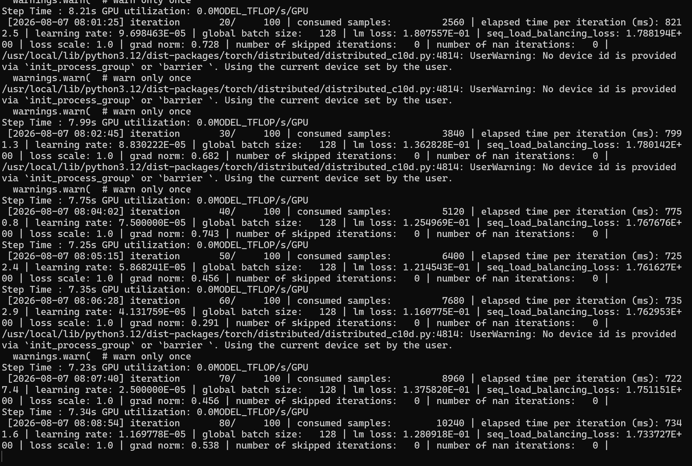
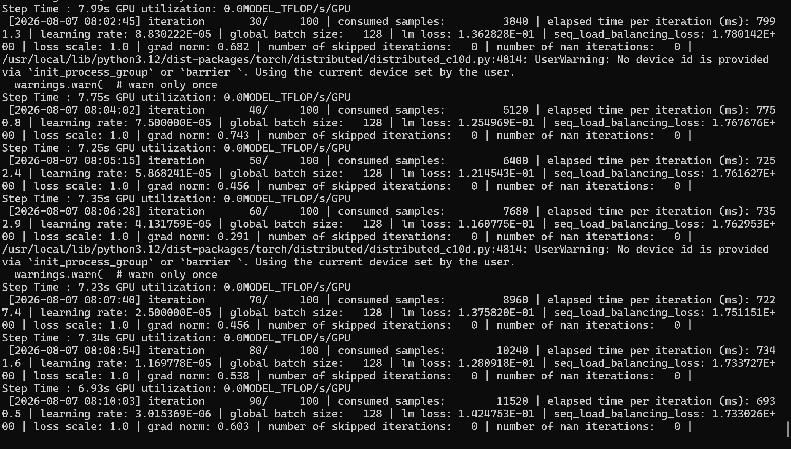
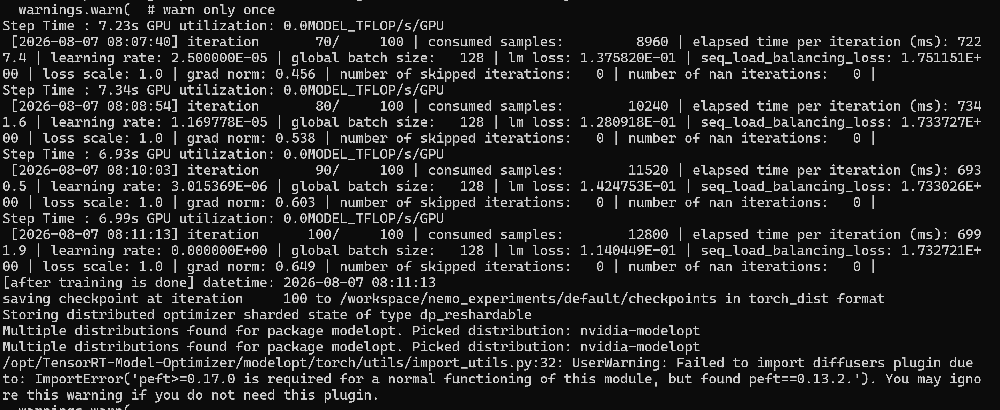
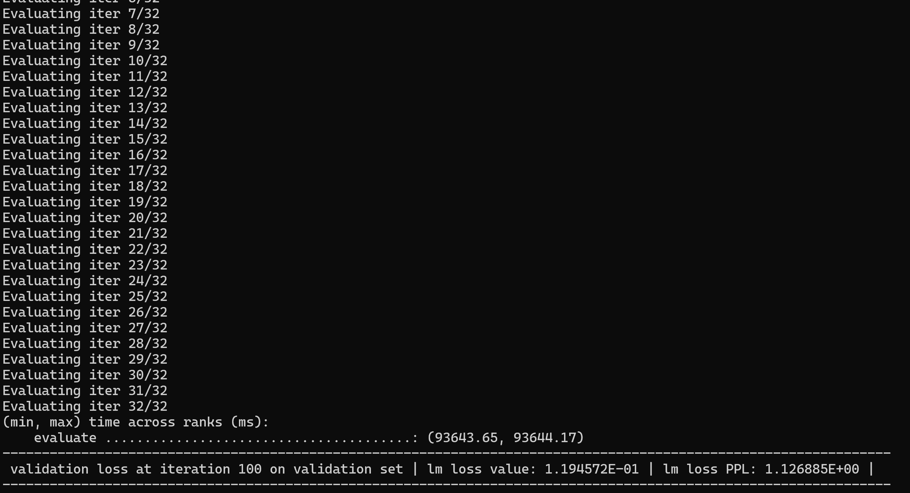

# Nemotron 3 Nano fine tuning

## Steps

### Validate the environment first

```
nvidia-smi

# 2. Check PyTorch + CUDA availability
python -c "import torch; print(f'PyTorch: {torch.__version__}'); print(f'CUDA available: {torch.cuda.is_available()}'); print(f'CUDA version: {torch.version.cuda}'); print(f'GPUs: {torch.cuda.device_count()}')"

# 3. Check NeMo / Megatron Bridge
python -c "from megatron.bridge.training.finetune import finetune; print('Megatron Bridge OK')"

# 4. Check mamba-ssm (required for Nemotron 3 Nano hybrid MoE architecture)
python -c "import mamba_ssm; print(f'mamba-ssm: {mamba_ssm.__version__}')"

# 5. Check causal-conv1d
python -c "import causal_conv1d; print(f'causal-conv1d: {causal_conv1d.__version__}')"

# 6. Check transformers
python -c "import transformers; print(f'transformers: {transformers.__version__}')"
```

### Finetuning

- Get the model downloaded
- Have to use tmp space for large downloads

```
rm -rf ~/.cache/huggingface/hub/models--nvidia--NVIDIA-Nemotron-3-Nano-30B-A3B-BF16/

# Redirect HF cache to the tmpfs (fast, 427GB free)
export HF_HOME=/workspace/hf_cache
mkdir -p $HF_HOME

# Retry
HF_MODEL_ID=nvidia/NVIDIA-Nemotron-3-Nano-30B-A3B-BF16

python /opt/Megatron-Bridge/examples/conversion/convert_checkpoints.py import \
  --hf-model $HF_MODEL_ID \
  --megatron-path /workspace/output/megatron/ckpt \
  --trust-remote-code
```
- for 8 gpu H100

```
torchrun --nproc-per-node=8 \
  /opt/Megatron-Bridge/examples/recipes/nemotron_3/finetune_nemotron_3_nano.py \
  --peft lora \
  train.global_batch_size=128 \
  train.train_iters=100 \
  scheduler.lr_warmup_iters=10 \
  checkpoint.pretrained_checkpoint=/workspace/output/megatron/ckpt
```

- Convert to HF format

```
# Step 3: Export back to HF format
python /opt/Megatron-Bridge/examples/conversion/convert_checkpoints.py export \
  --hf-model $HF_MODEL_ID \
  --megatron-path /workspace/output/megatron/ckpt \
  --hf-path /workspace/output/hf/ckpt
```

- upload to huggingface

```
pip install huggingface_hub

# Login (one-time)
huggingface-cli login
# Paste your HF token from https://huggingface.co/settings/tokens

# Upload the model
hf upload Balab2021/nemotron-3-nano-finetuned /workspace/output/hf/ckpt .
```






- Next will be to try in pytche - Blackwell